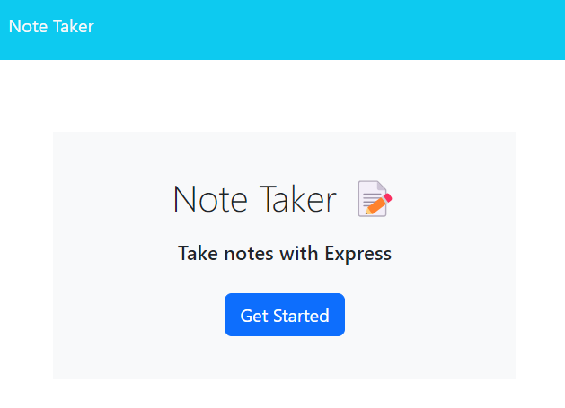

# Note Taker

[](https://opensource.org/licenses/MIT)

## Description

A simple note taking app for Node.js

## Table of Contents

* [Installation](#installation)
* [Usage](#usage)
* [License](#license)
* [Contributing](#contributing)
* [Tests](#tests)
* [Questions](#questions)

## Installation

Run ```npm install``` in the root directory

## Usage

Run ```npm start``` in the root directory.

A live version can also be found [here](https://be3be0ba777f2669be35da9b12f3-bacf9173a609.herokuapp.com/)

Preview:



## License

This project uses the [MIT](https://opensource.org/licenses/MIT) license.

## Contributing

No contributions accepted

## Tests

n/a

## Questions

If you have any questions, please contact me at [github@alexbi.shop](mailto:github@alexbi.shop).

You can also find me on [Github](https://github.com/alexbishopbootcamp).

